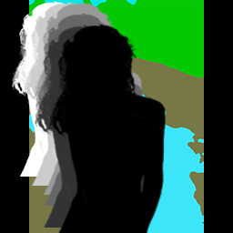
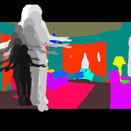

# Auto-Retoucher(ART)--A Framework for Background Replacement and Foreground adjustment
Given someone's photo, generates a new image with best matching background, and find the best spatial location and scale.

A PyTorch implementation of ART framework. Our preprint paper has been upleaded to arXiv: http://arxiv.org/abs/1901.03954

For more information please visit our [website](https://suyang98.github.io/Auto-Retoucher/). Besides, there is a video [demo](https://v.qq.com/x/page/o082798ic8d.html).

## Abstract
Replacing the background and simultaneously adjusting foreground objects is a challenging task in image editing. Current techniques for generating such images are heavily relied on user interactions with image editing softwares, which is a tedious job for professional retouchers. Some exciting progress on image editing has been made to ease their workload. However, few models focused on guarantee the semantic consistency between the foreground and background. To solve this problem, we propose a   framework —— ART(Auto-Retoucher)，to generate images with sufficient semantic and spatial consistency from a given image. Inputs are first processed by semantic matting and scene parsing modules, then a multi-task verifier model will give two confidence scores for the current matching and foreground location. We demonstrate that our jointly optimized verifier model successfully guides the foreground adjustment and improves the global visual consistency.

### Example foreground images:


### Output Images:

The backgrounds are selected from gallery, with best content-level consistency.


### moving sequence:
Adjustment procedure guided by model's gradient. 

Fg moves from a random initial location to a plausible position




## Requirements
```
pytroch=0.4.1  
tensorboardX  
tqdm   
cv2 
``` 
## Training:

```
python train.py --train_path=YOUR_DATA_PATH   
                --test_path=YOUR_TEST_DATA_PATH
                --submit_dir=./submission
                --batch_size=20
                --epochs=10
                --attention
```

## Inference:

```
python Inference.py --test_img=YOUR_TEST_IMAGE
                    --top_k=5
                    --sample_num=100
```
