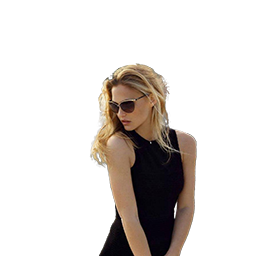
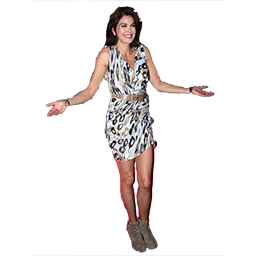
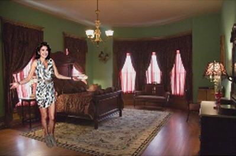
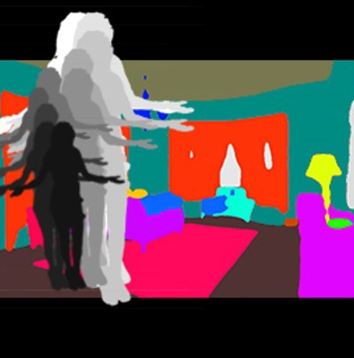

# Auto-Retoucher(ART)--A Framework for Background Replacement and Foreground adjustment
Given someone's photo, generates a new image with best matching background, and find the best spatial location and scale.

A PyTorch implementation of ART framework.

### Example foreground images:




### demo:



### moving sequence:
Adjustment procedure guided by model's gradient. 

Fg moves from a random initial location to a plausible position




## Framework:


## Training:

```
python train.py
```

## Inference:

```
python Inference.py
```
